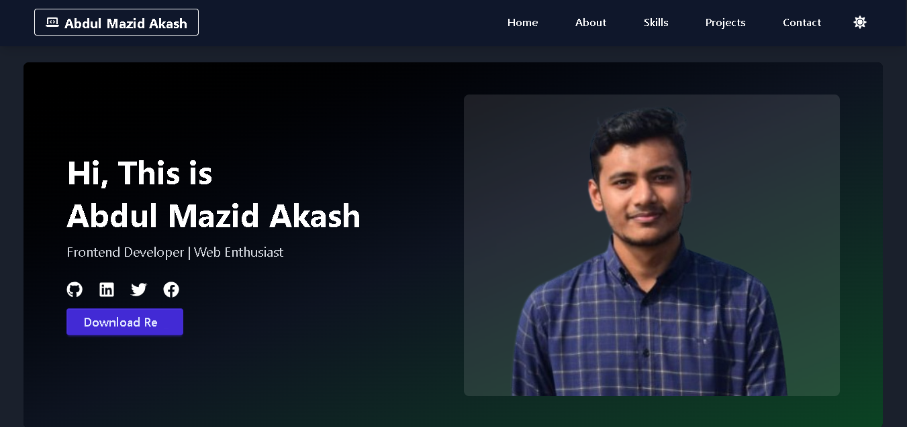
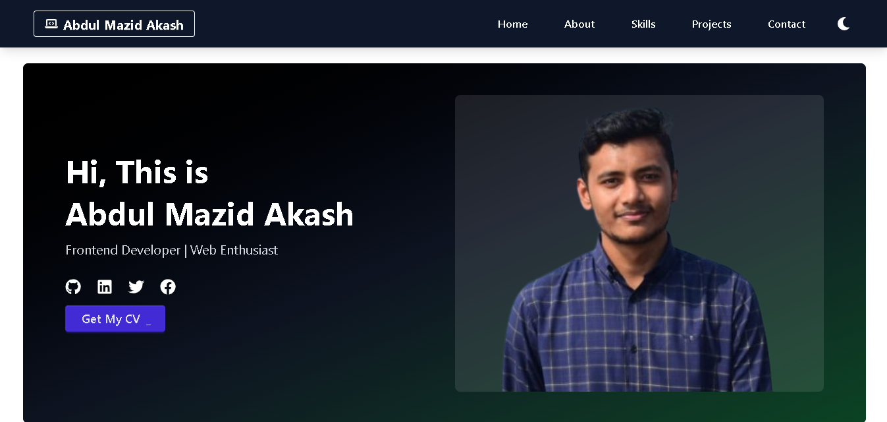

```md
# 🚀 Professional Portfolio 2025

<!-- ) -->

Welcome to my **Professional Portfolio 2025**! This project showcases my skills, experience, and work as a **Frontend Developer**. Built with **React, Tailwind CSS, Framer Motion, and Vite**, this portfolio is designed to be **fast, responsive, and visually appealing**.

🔗 **Live Demo:** [View Portfolio](https://abdulmazidakash.netlify.app/)

---

## 📌 Table of Contents
- [Features](#-features)
- [Tech Stack](#-tech-stack)
- [Installation](#-installation)
- [Usage](#-usage)
- [Project Structure](#-project-structure)
- [Screenshots](#-screenshots)
- [Contributors](#-contributors)
- [License](#-license)

---

## ✨ Features

✅ **Fully Responsive** – Works on all devices  
✅ **Dark/Light Mode Toggle** – Smooth theme switching  
✅ **Animated UI** – Engaging motion effects with Framer Motion  
✅ **Optimized Performance** – Fast loading with Vite  
✅ **Downloadable Resume** – Easily get my CV  
✅ **Interactive Navigation** – Smooth scrolling and easy access to sections  

---

## 🛠 Tech Stack

- **Frontend**: React 19, Tailwind CSS, Framer Motion  
- **Routing**: React Router 7  
- **Icons**: FontAwesome, React Icons  
- **Linting**: ESLint  

---

## ⚡ Installation

1️⃣ **Clone the Repository**
```bash
git clone https://github.com/abdulmazidakash/professional-portfolio-2025
cd professional-portfolio-2025
```

2️⃣ **Install Dependencies**
```bash
npm install
```

3️⃣ **Run Development Server**
```bash
npm run dev
```

4️⃣ **Build for Production**
```bash
npm run build
```

---

## 🚀 Usage

- Run `npm run dev` to start a local development server.
- Navigate to [`http://localhost:5173`](http://localhost:5173) to view the portfolio.
- Modify the `src/components` directory to update sections as needed.

---

## 📁 Project Structure

```
professional-portfolio-2025/
│── public/               # Static assets
│── src/
│   ├── components/       # Reusable UI components (Navbar, Hero, etc.)
│   ├── contexts/         # ThemeContext for Dark/Light mode
│   ├── pages/            # Page components
│   ├── styles/           # Tailwind CSS styles
│   ├── App.jsx           # Main application file
│   ├── main.jsx          # Entry point
│── package.json          # Project dependencies and scripts
│── vite.config.js        # Vite configuration
│── README.md             # Project documentation
```

---

## 📸 Screenshots

### 🌙 Dark Mode:
()
<!-- ) -->

### ☀️ Light Mode:
()
<!-- ) -->

---

## 👨‍💻 Contributors

- **[Abdul Mazid Akash](https://github.com/abdulmazidakash)** - Creator & Developer

---

## 📜 License

This project is licensed under the **MIT License**.

---

🎯 **If you like this project, don't forget to star ⭐ the repository!**
```

---
